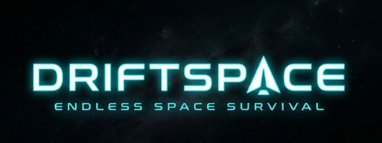

# DRIFTSPACE

> Minimalist infinite space survival. No story. Pure skill.



**[▶ PLAY NOW](https://drift-space.vercel.app/)**

---

## About

DRIFTSPACE is a browser-based arcade survival game built with React and HTML5 Canvas. Dodge and destroy procedurally generated asteroids as difficulty scales over time. Survive as long as possible. Your score is your legacy.

---

## Gameplay

- Asteroids drift in from all directions
- Speed and spawn rate increase every wave
- Large asteroids split into two on first hit
- 3 lives — lose them all and it's over
- Score is based on asteroid size × kills

---

## Controls

| Key | Action |
|-----|--------|
| `W A S D` | Navigate |
| `SPACE` | Fire |
| `P` | Pause |

---

## Tech Stack

- **React** + **Vite**
- **HTML5 Canvas** — game rendering
- **LocalStorage** — persistent high scores
- **Vercel** — deployment

---

## Project Structure
src/
game/
constants.js       # Tunable game values
Ship.js            # Ship physics + rendering
Asteroid.js        # Asteroid spawning, splitting, rendering
Bullet.js          # Bullet movement + rendering
Particle.js        # Explosion + thrust particles
useGameLoop.js     # Core game loop, collision detection
components/
GameCanvas.jsx     # Canvas mount + resize
HUD.jsx            # Score, lives, wave display
Menu.jsx           # Main menu, pause, leaderboard screens
DeathScreen.jsx    # End screen + high score table
hooks/
useHighScores.js   # LocalStorage score persistence
App.jsx              # Game state machine
---

## Run Locally

```bash
git clone https://github.com/ananya24s/DriftSpace.git
cd DriftSpace
npm install
npm run dev
```

---

## Roadmap

- [ ] Power-ups (shield, rapid fire, bomb)
- [ ] Sound effects
- [ ] Mobile touch controls
- [ ] Online leaderboard

---

## License

MIT
